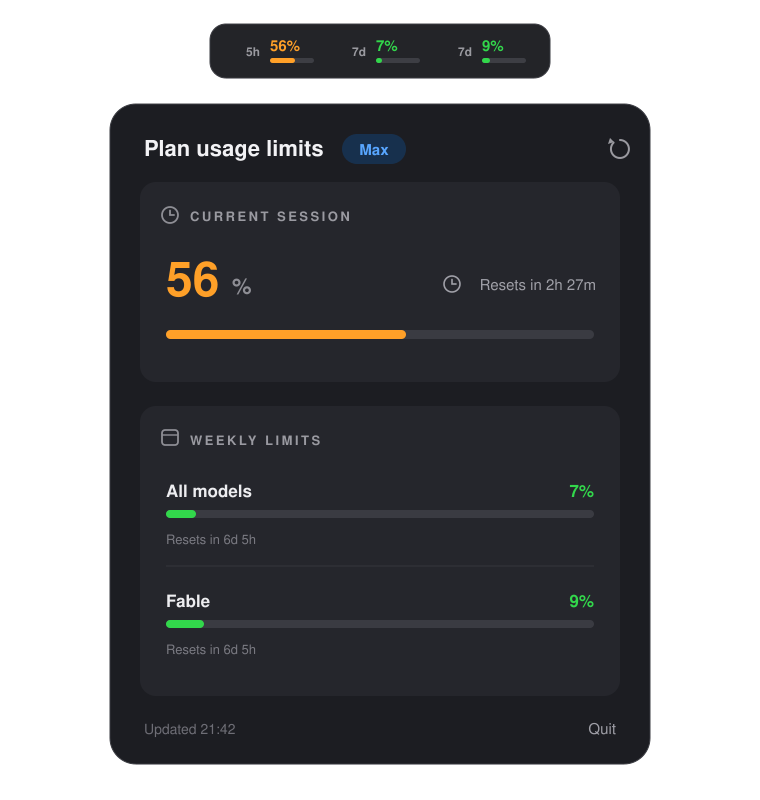

<div align="center">
  
  <h1>ClaudeLimit</h1>
  <p>
    Menu bar app + macOS widget showing Claude Code usage limits<br>
    (5-hour session / weekly / per-model) — the same data as Claude Code's <code>/usage</code> command.
  </p>
  <p>
    <a href="https://github.com/prongbang/ClaudeLimit/releases/latest">
      
    </a>
    <a href="https://github.com/prongbang/ClaudeLimit/releases">
      
    </a>
  </p>
  
</div>

## Install

1. Download the DMG from the [latest release](https://github.com/prongbang/ClaudeLimit/releases/latest)
2. Open it and drag **ClaudeLimit** into **Applications**
3. First launch: right-click the app → **Open** (release DMGs are ad-hoc signed,
   so macOS asks once)

## How it works

- Reads the Claude Code OAuth token from `CLAUDE_CODE_OAUTH_TOKEN`, then
  `~/.claude/.credentials.json`
- Automatic background refreshes avoid the macOS Keychain, so the app does not
  repeatedly ask for Keychain access while polling usage
- A user-initiated token refresh can still fall back to the Claude Code Keychain
  item (`Claude Code-credentials`) if the credentials file is unavailable
- Calls `GET https://api.anthropic.com/api/oauth/usage` every 180 seconds
  (polling faster gets rate limited with 429)
- The menu bar shows session, weekly, and per-model usage at a glance;
  click for details (reset countdowns, plan name)
- Snapshots are cached in an App Group container for the widget to read
  (the widget never calls the API itself — the extension sandbox
  cannot access the Keychain item)

## Build

Requires Xcode 15+ and [XcodeGen](https://github.com/yonaskolb/XcodeGen)

```bash
brew install xcodegen
cd ClaudeLimit
xcodegen generate
open ClaudeLimit.xcodeproj
```

Then in Xcode:

1. Select the `ClaudeLimit` target → Signing & Capabilities → pick your own Team (both targets)
2. Run the `ClaudeLimit` target

## After the first run

- No Keychain permission is needed for normal usage polling
- If credentials are missing, run `claude` in Terminal first so Claude Code writes
  `~/.claude/.credentials.json`
- If an older install already has a broken Keychain ACL prompt loop, run
  `./scripts/fix-keychain.sh` once from Terminal
- Add the widget: right-click the desktop → Edit Widgets → search for "Claude Limit Usage"

## Release (DMG)

```bash
./scripts/release.sh 1.0.0
```

For a Gatekeeper-clean DMG (no warnings on other Macs), set
`SIGN_IDENTITY` (a Developer ID Application certificate) and
`NOTARY_PROFILE` (a `notarytool` keychain profile) before running —
see the header of [scripts/release.sh](scripts/release.sh) for setup.
Without them the DMG is ad-hoc signed: fine for your own machine, but
others must right-click → Open on first launch.

## Known limitations

- The endpoint is an undocumented API (community-discovered) and may change
- The access token expires after ~60 minutes; use the in-app refresh button or
  run `claude` in Terminal if the refresh token is no longer valid
- The widget stays fresh only while the menu bar app is running
  (recommended: add it to Login Items)
- The `User-Agent: claude-code/<version>` header is required — without it
  the endpoint rate-limits immediately

## Structure

```
ClaudeLimit/
├── project.yml                 # XcodeGen spec
├── scripts/
│   └── release.sh              # build + sign + notarize + DMG
├── App/                        # menu bar app (MenuBarExtra)
│   ├── ClaudeLimitApp.swift
│   ├── MenuContentView.swift
│   └── ClaudeLimit.entitlements
├── Widget/                     # WidgetKit extension (small + medium)
│   ├── ClaudeLimitWidget.swift
│   └── ClaudeLimitWidget.entitlements
└── Shared/                     # shared between both targets
    ├── UsageModels.swift       # models + date parsing
    ├── CredentialsProvider.swift # Keychain / file / env token
    ├── UsageAPI.swift          # /api/oauth/usage client
    └── UsageStore.swift        # App Group cache
```
